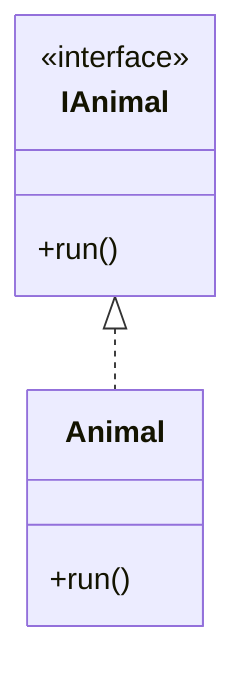
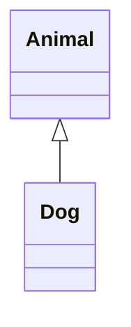
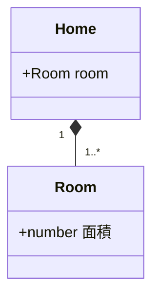
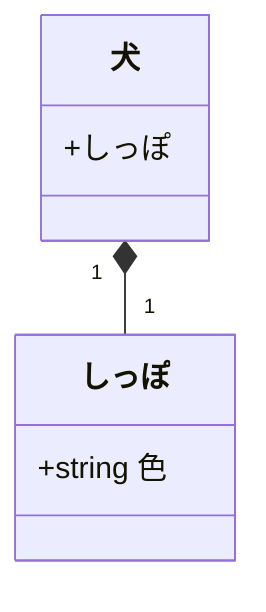
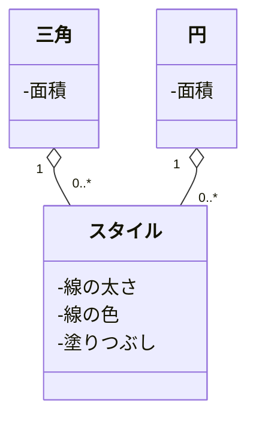
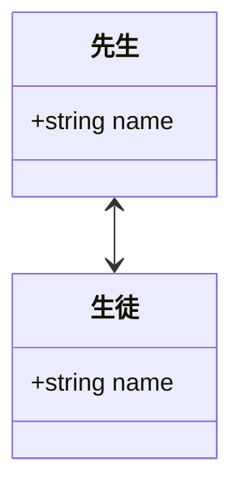
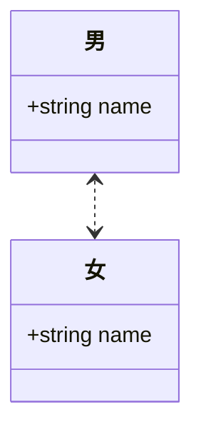

# UML クラス図

関係の強い順番

1. 実現（realization）
1. 継承（inheritance）
1. 構成（composition）
1. 集約（aggregation）
1. 関連（association）
1. 依存（dependency）

**依存（dependency）** は、注意が必要

## 実現（realization）

interfaceと実装の関係

## 継承（inheritance）

親子関係

## 構成（composition）

独立して存在できない関係

## 集約（aggregation）

独立して存在できる関係

複数の「全体」インスタンスが、1つの「部分」インスタンスを共有する

## 関連（association）

少し関係がある

## 依存（dependency）

なんらかの関係

